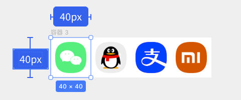
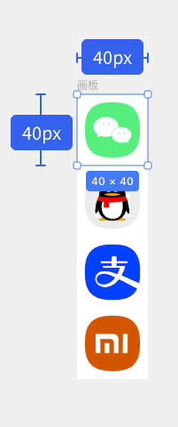
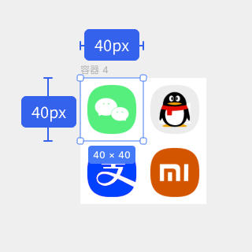

## CSS Sprites（精灵图）详解

### 什么是CSS Sprites

CSS Sprites是一种将多个小图片合并成一张大图的技术，通过CSS的`background-position`属性来显示所需的部分。这种方法可以显著减少HTTP请求次数，提高网页加载性能。

### 图片排布方式

#### 1. 水平排列
将所有小图标从左到右依次排列在一行中：


#### 2. 垂直排列
将所有小图标从上到下依次排列在一列中：


#### 3. 网格排列
将图标按照行列的方式进行排列，形成网格状：


#### 4. 排布注意事项
- 需要在图标之间留出适当的间距（通常1-2px），避免背景图片错位
- 合理安排图标位置，便于计算坐标
- 考虑图片大小，避免生成过大的Sprites图片影响加载速度

### 坐标定位

#### 定位原理
使用`background-position`属性来控制显示Sprites图片的特定区域，坐标原点在图片左上角。

#### 坐标计算规则
- **正坐标**：向右为x轴正方向，向下为y轴正方向
- **负坐标**：通常使用负值来定位，因为需要将图片的非目标区域移出显示区域
- **计算公式**：目标图标左上角坐标 = (负的x坐标, 负的y坐标)

#### 示例
```css
.sprite {
  background-image: url('sprite.png');
  width: 16px;
  height: 16px;
  background-repeat: no-repeat;
}

.icon-home {
  background-position: 0 0; /* 第一个图标 */
}

.icon-user {
  background-position: -16px 0; /* 第二个图标，向左偏移16px */
}

.icon-setting {
  background-position: 0 -16px; /* 第三个图标，向上偏移16px */
}

.icon-message {
  background-position: -16px -16px; /* 第四个图标，向左和向上各偏移16px */
}
```

### 缩放比例处理

#### 1. 高分辨率屏幕适配
为高DPI屏幕准备2倍或3倍图：
```css
.icon {
  width: 16px;
  height: 16px;
  background-image: url('sprite.png');
  background-size: 100px 50px; /* 实际图片尺寸 */
}

@media (-webkit-min-device-pixel-ratio: 2), (min-resolution: 192dpi) {
  .icon {
    background-image: url('sprite@2x.png');
    background-size: 100px 50px; /* 显示尺寸保持不变 */
  }
}
```

#### 2. 响应式设计
使用相对单位和媒体查询：
```css
.icon {
  background-size: cover;
}

@media (max-width: 768px) {
  .icon {
    width: 12px;
    height: 12px;
    background-size: 75px 37.5px;
  }
}
```

### 实际案例

#### 案例1：导航菜单图标
```html
<ul class="nav">
  <li><a href="#" class="icon-home">首页</a></li>
  <li><a href="#" class="icon-about">关于</a></li>
  <li><a href="#" class="icon-contact">联系</a></li>
</ul>
```

```css
.nav a {
  display: inline-block;
  padding-left: 20px;
  background-image: url('nav-sprite.png');
  background-repeat: no-repeat;
  line-height: 16px;
}

.icon-home {
  background-position: 0 0;
}

.icon-about {
  background-position: -16px 0;
}

.icon-contact {
  background-position: -32px 0;
}
```

#### 案例2：按钮状态
```css
.btn {
  width: 100px;
  height: 30px;
  background-image: url('button-sprite.png');
}

.btn-default {
  background-position: 0 0;
}

.btn-hover {
  background-position: 0 -30px;
}

.btn-active {
  background-position: 0 -60px;
}
```

### 常见问题及解决方案

#### 1. 图标之间出现其他图标
**问题**：由于没有留白或计算错误，显示时出现相邻图标的一部分。
**解决方案**：
- 在制作Sprites图片时确保图标之间有1-2px间距
- 精确计算`background-position`值

#### 2. 高分辨率屏幕显示模糊
**问题**：在Retina屏幕上图标显示模糊。
**解决方案**：
- 提供高分辨率Sprites图片
- 使用`background-size`属性调整显示尺寸

#### 3. 维护困难
**问题**：添加或修改图标时需要重新制作整张Sprites图片。
**解决方案**：
- 合理规划图标分类，按功能分组制作多张Sprites图片
- 使用工具自动化生成Sprites图片和CSS代码

#### 4. 文件过大影响加载
**问题**：Sprites图片过大导致首屏加载缓慢。
**解决方案**：
- 将不常用的图标分离到其他Sprites图片中
- 按页面或模块拆分Sprites图片

#### 5. 响应式适配问题
**问题**：在不同屏幕尺寸下Sprites图片显示异常。
**解决方案**：
- 使用媒体查询为不同屏幕提供适配方案
- 结合`background-size`属性进行缩放控制

### 最佳实践建议

1. **合理规划**：根据使用频率和功能对图标进行分组
2. **统一尺寸**：尽量使用统一的图标尺寸，便于计算和维护
3. **工具辅助**：使用自动化工具生成Sprites图片和CSS代码
4. **性能考量**：平衡图片大小和HTTP请求数量
5. **可访问性**：为图标提供文字替代方案，确保可访问性