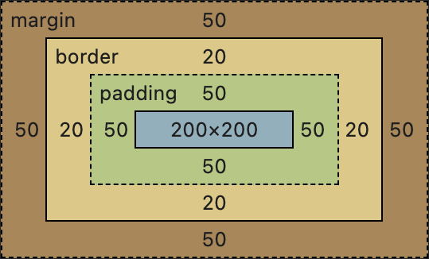
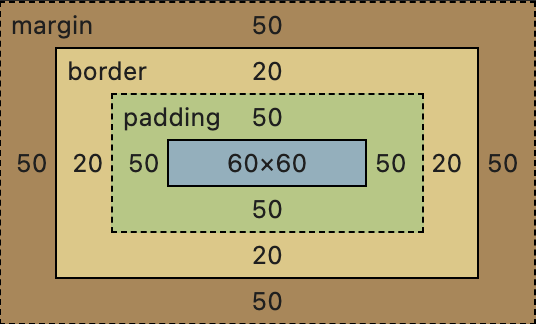

# CSS 盒模型详解

在CSS中，盒模型是理解元素布局和尺寸计算的基础。每个HTML元素都可以被视为一个矩形盒子，这个盒子由内容区域、内边距、边框和外边距组成。本文将详细介绍几种盒模型的区别及其应用场景。

## 1. 标准盒模型（W3C Box Model）


标准盒模型是W3C推荐的盒模型，也是默认的盒模型。在这个模型中，元素的总宽度和高度是由以下部分组成的：

- **内容区域（Content Area）**：实际内容占据的空间。
- **内边距（Padding）**：内容区域与边框之间的空间。
- **边框（Border）**：围绕内容区域和内边距的边框。
- **外边距（Margin）**：元素与其他元素之间的间距。

### 计算规则

假设一个元素的宽度设置为 `width: 200px`，内边距为 `padding: 10px`，边框为 `border: 5px`，则该元素的实际总宽度为：

\[ \text{总宽度} = \text{内容宽度} + 2 \times \text{内边距} + 2 \times \text{边框} \]

\[ \text{总宽度} = 200px + 2 \times 10px + 2 \times 5px = 230px \]

### 应用场景

标准盒模型适用于大多数情况，特别是当需要精确控制内容区域的大小时。例如，在设计固定宽度的布局时，标准盒模型可以确保内容区域的大小不会因为内边距和边框的变化而改变。

## 2. IE盒模型（Quirks Mode Box Model）

IE盒模型是早期Internet Explorer浏览器使用的盒模型。在这个模型中，元素的总宽度和高度不包括内边距和边框，而是将它们包含在内容区域内。

### 计算规则

假设一个元素的宽度设置为 `width: 200px`，内边距为 `padding: 10px`，边框为 `border: 5px`，则该元素的实际内容宽度为：

\[ \text{内容宽度} = \text{总宽度} - 2 \times \text{内边距} - 2 \times \text{边框} \]

\[ \text{内容宽度} = 200px - 2 \times 10px - 2 \times 5px = 170px \]

### 应用场景

IE盒模型在现代Web开发中已经很少使用，但在某些老旧项目或兼容性要求较高的情况下，可能会遇到这种模型。了解IE盒模型有助于解决一些历史遗留问题。

## 3. 盒模型切换（box-sizing 属性）

为了在不同盒模型之间切换，CSS提供了 `box-sizing` 属性。该属性有两个主要值：

- **content-box**：使用标准盒模型。
- **border-box**：使用IE盒模型。

### 示例


```css
/* 使用标准盒模型 */
.box1 {
  width: 200px;
  padding: 50px;
  border: 20px solid black;
  margin: 50px;
  box-sizing: content-box;
}
```

```css
/* 使用IE盒模型 */
.box2 {
  width: 200px;
  padding: 50px;
  border: 20px solid black;
  margin: 50px;
  box-sizing: border-box;
}
```

## 4. 应用场景

### 标准盒模型（content-box）

- **精确控制内容区域**：当需要确保内容区域的大小不变时，使用标准盒模型。
- **固定宽度布局**：在设计固定宽度的布局时，标准盒模型可以确保内容区域的大小不会因为内边距和边框的变化而改变。

### IE盒模型（border-box）

- **灵活的布局**：当需要确保元素的总宽度和高度不变时，使用IE盒模型。这在响应式设计中特别有用，可以避免因为内边距和边框的变化导致元素溢出。
- **栅格系统**：在构建栅格系统时，使用IE盒模型可以确保列的总宽度始终一致，避免因为内边距和边框的变化导致布局错乱。

## 总结

本文详细介绍了CSS中的几种盒模型，包括标准盒模型、IE盒模型以及如何使用 `box-sizing` 属性在不同盒模型之间切换。理解盒模型的概念和计算规则对于前端开发来说非常重要，它可以帮助我们更好地控制元素的布局和尺寸。希望本文能帮助你更好地理解和应用CSS盒模型。如果你有任何疑问或需要进一步的指导，欢迎随时提问。